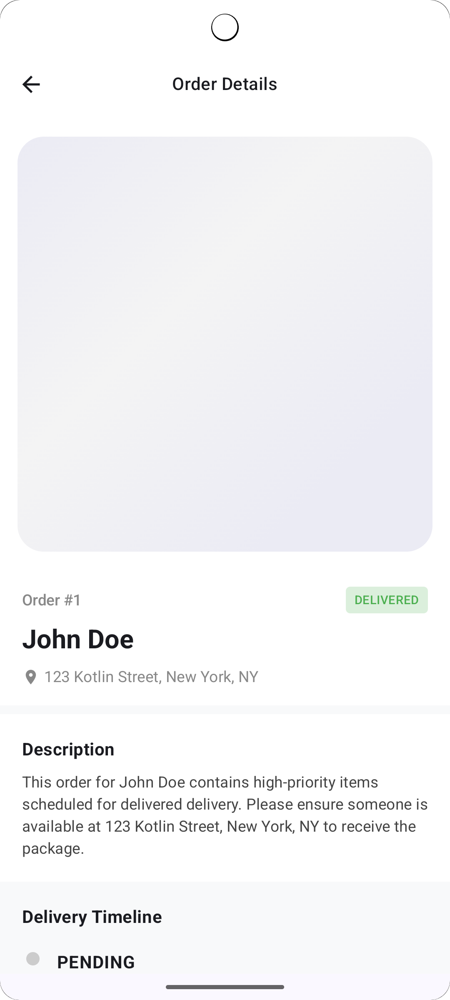
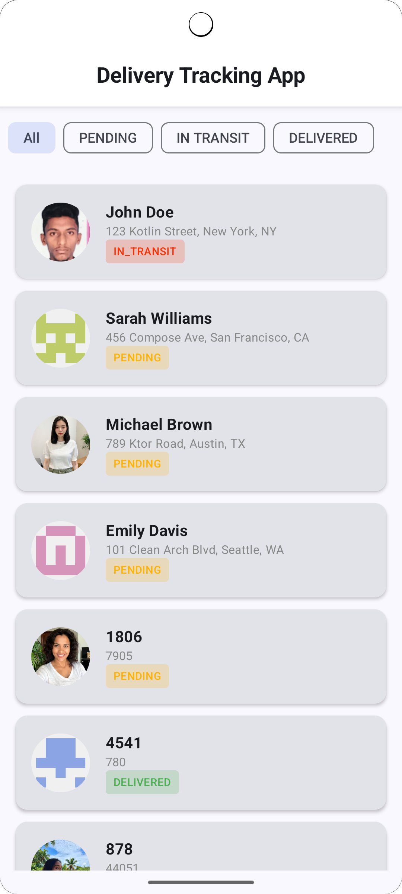
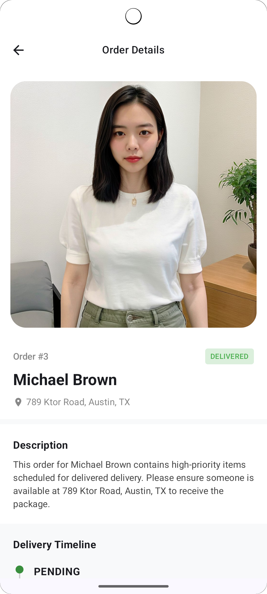

## 📱 App Showcase


| Loading State (Shimmer) | Order List (All) | Filtered State |
|:---:|:---:|:---:|
|  |  |  |
---

# 🚚 Delivery Tracking System (Android)

A lightweight, scalable Delivery Tracking application built with modern Android development practices.  
The project demonstrates clean architecture principles, unidirectional data flow, and production-minded decision making within a time-boxed environment.

---

## 📌 Overview

The system simulates a delivery tracking workflow where:
- Customers can view their orders
- Orders can be filtered by status
- Order details reflect updates over time (near real-time simulation)

The focus of this implementation is **architecture, scalability, and maintainability**, rather than feature completeness.

---

## 🧱 Tech Stack

- **Kotlin**
- **Jetpack Compose**
- **MVVM + MVI-inspired architecture**
- **Kotlin Coroutines + Flow**
- **Hilt (Dependency Injection)**
- **Retrofit + OkHttp**
- **MockAPI.io (Backend simulation)**

---

## 🏛 Architecture Approach

This project follows a **Clean Architecture-inspired MVVM + MVI hybrid approach**.

### 🎯 Why this approach?

The design prioritizes:

- Predictable state management
- Clear separation of concerns
- Testability at each layer
- Scalability for additional features (e.g. driver app, admin panel)

---

## 🔄 Data Flow

```text
UI (Jetpack Compose)
    ↓ (User Intents / Events)
ViewModel (MVI State Reducer)
    ↓
Use Cases (Business Logic)
    ↓
Repository (Single Source of Truth)
    ↓
Remote Data Source (Retrofit API)

```

## ⚖️ Trade-offs

Due to time constraints, the following decisions were made:

- Used **MockAPI.io** instead of a custom backend
- Implemented **polling instead of WebSockets** for real-time simulation
- Omitted **Room database (offline caching)**
- Kept a **single-module structure** instead of full modularization
- Simplified error handling using a basic `Resource` wrapper

---

## 🚀 Future Improvements

For production readiness, the following enhancements are planned:

- **Offline support with Room caching**
- **Pagination (Paging 3) for large datasets**
- **WebSocket/Firebase for real-time updates**
- **Unit & UI tests (ViewModel + Compose UI)**
- **Feature-based modularization**
- **CI/CD pipeline (GitHub Actions)**
- **Crash reporting & analytics integration**
- **Linter for coding standards**
- **Integrate Sonarcube for code coverage and code smells**
